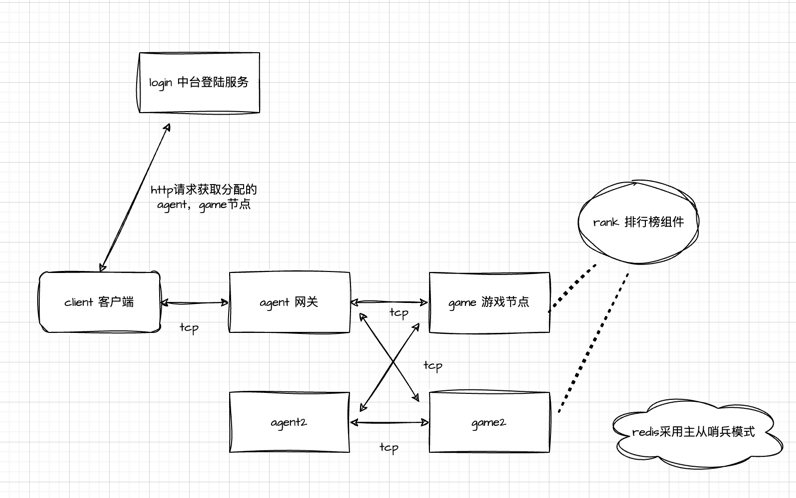

# rank
排行榜

## 测试用例
位于test目录

## 系统设计

1.可靠性
- 以长连接服务为例, 采用分布式架构.
- 客户端先从中台login服务获取分配的agent, game节点, 从而构建一个完整的client<->agent<->game链路.
- 排行榜以组件的形式在game节点调用.
- agent, game节点都是分布式的, 可以保证进程的高可用.
- redis采用主从哨兵模式保证redis的高可用.
- 对于数据一致性, 如果玩家个人的排行榜同步不会并发, 则无需特别处理; 对于并发同步, 可采用redis-lua脚本, 原子性的执行多条命令.

2.性能
- 从运维侧考虑, 对redis进行主从配置, 提高redis的qps.
- 对于程序侧, 如果redis已经接近了性能瓶颈, 需要降低一定的实时性:
- 比如对排行榜列表缓存10s, 可大大降低从redis的获取的压力;
- 其次对于变动特别频繁的同步, 可以考虑聚合更新, 减少同步频次.

## 密集排名
- 新增配置项RankConf.isDense, 以及用于不同分数排序的有序集合RedisDenseKey(元素和分值都是分数)
````
isDense           bool                     // 是否是密集排名

func (rc *RankConf) RedisDenseKey(regionId int64) (key string) {
	return rc.spellRedisKey(regionId, "RankDense")
}
````
- 首先需要停服并创建密集排名, 并修改对应排行榜的RankConf.isDense=true
````
// CreateDenseData 创建密集排名
func (rc *RankConf) CreateDenseData(regionId int64) (err error) {
	count, err := redis_wrapper.Rdb().ZCard(context.TODO(), rc.RedisKey(regionId)).Result()
	if err != nil {
		return err
	}

	// 分页处理
	tools.PageRange(int(count), 1000, func(page, startIndex, endIndex int) {
		zl, err := redis_wrapper.Rdb().ZRangeWithScores(context.TODO(), rc.RedisKey(regionId), int64(startIndex), int64(endIndex)).Result()
		if err != nil {
			// err_log
			return
		}

		m := make(map[int64]struct{}, 1)
		for _, v := range zl {
			score := int64(v.Score)
			if rc.IsTimeScore() { // 去除时间戳
				score = GetRankRealScore(score)
			}
			if _, ok := m[score]; !ok {
				m[score] = struct{}{}
			}
		}
		for k := range m {
			err = redis_wrapper.Rdb().ZAdd(context.TODO(), rc.RedisDenseKey(regionId), redis.Z{Score: float64(k), Member: k}).Err()
			if err != nil {
				// err_log
			}
		}
	})

	return
}
````
- 对于更新操作, 如果同步后旧分数不存在了, 需要在Dense排行榜进行删除, 并更新新分数
````
// 密集排名
	if rc.IsDense() {
		// 旧分数是否还存在
		isExistOld := false
		if rc.IsTimeScore() { // 带时间戳
			zl, err := redis_wrapper.Rdb().ZRangeByScore(context.TODO(), rc.RedisKey(regionId), &redis.ZRangeBy{
				Min: fmt.Sprintf("%d", score<<constants.RankScoreOffsetBits), Max: fmt.Sprintf("%d", (score+1)<<constants.RankScoreOffsetBits-1), Offset: 0, Count: 1,
			}).Result()
			if err == nil && len(zl) > 0 {
				isExistOld = true
			}
		} else { // 不带时间戳
			zl, err := redis_wrapper.Rdb().ZRangeByScore(context.TODO(), rc.RedisKey(regionId), &redis.ZRangeBy{
				Min: fmt.Sprintf("%d", oldScore), Max: fmt.Sprintf("%d", oldScore), Offset: 0, Count: 1,
			}).Result()
			if err == nil && len(zl) > 0 {
				isExistOld = true
			}
		}
		// 旧分数不存在, 从 RedisDenseKey 移除
		if !isExistOld {
			err = redis_wrapper.Rdb().ZRem(context.TODO(), rc.RedisDenseKey(regionId), oldScore).Err()
			if err != nil {
				// err_log
			}
		}

		// 添加新分数到 RedisDenseKey
		err = redis_wrapper.Rdb().ZAdd(context.TODO(), rc.RedisDenseKey(regionId), redis.Z{Score: float64(newScore), Member: newScore}).Err()
		if err != nil {
			// err_log
		}
	}
````
- 获取前N名玩家, 找到分数下限, 按分数获取, 然后对排行榜进行处理(周围玩家列表同理)
````
if rc.IsDense() { // 密集排名
		// 获取第n名的分数
		scoreZl, err := redis_wrapper.Rdb().ZRevRangeWithScores(context.TODO(), rc.RedisDenseKey(regionId), n-1, n-1).Result()
		if err != nil {
			return nil, err
		}
		if len(scoreZl) != 1 {
			return nil, errors.New("scoreZl is empty")
		}

		zl := make([]redis.Z, 0, n)

		// 根据分数范围查找
		minScore := scoreZl[0].Score // 不带时间戳的分数下限
		if rc.IsTimeScore() {        // 带时间戳
			zl, err = redis_wrapper.Rdb().ZRevRangeByScoreWithScores(context.TODO(), rc.RedisKey(regionId), &redis.ZRangeBy{
				Min: fmt.Sprintf("%d", int64(minScore)<<constants.RankScoreOffsetBits), Max: "+inf", Offset: 0, Count: -1,
			}).Result()
			if err != nil {
				return nil, err
			}
		} else { // 不带时间戳
			zl, err = redis_wrapper.Rdb().ZRevRangeByScoreWithScores(context.TODO(), rc.RedisKey(regionId), &redis.ZRangeBy{
				Min: fmt.Sprintf("%f", minScore), Max: "+inf", Offset: 0, Count: -1,
			}).Result()
			if err != nil {
				return nil, err
			}
		}

		lastScore := int64(math.MinInt)
		curRank := int32(0)
		for _, v := range zl {
			member, score, err := ParseUserScoreRet(v, rc.IsTimeScore())
			if err != nil {
				return nil, err
			}

			if score != lastScore {
				lastScore = score
				curRank++
			}
			list = append(list, &pb.PbRank{
				Member: member,
				Score:  score,
				Rank:   curRank,
			})
		}
	}
````
- 获取当前排名, 先获取分数, 再从密集排行中获取排名
````
if rc.IsDense() { // 密集排名
		// 先获取分数
		score, err := rc.GetScore(regionId, member)
		if err != nil {
			return 0, err
		}

		// 从 RedisDenseKey 获取
		if rc.IsPositiveSort() { // 是否正序
			rank, err = redis_wrapper.Rdb().ZRank(context.TODO(), rc.RedisDenseKey(regionId), fmt.Sprintf("%d", score)).Result()
			if err != nil {
				return 0, err
			}
		} else {
			rank, err = redis_wrapper.Rdb().ZRevRank(context.TODO(), rc.RedisDenseKey(regionId), fmt.Sprintf("%d", score)).Result()
			if err != nil {
				return 0, err
			}
		}
	}
````
